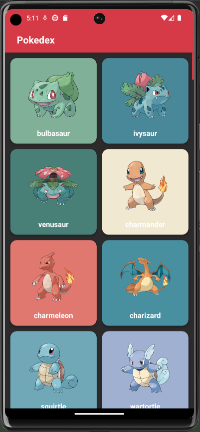
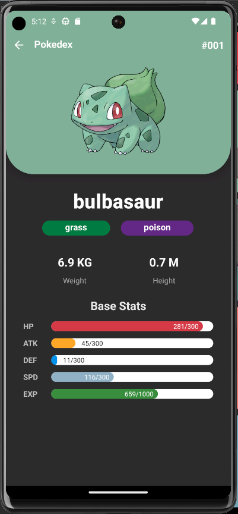

# Pokedex App

## Project Description
The Pokedex App is an Android application designed to provide users with a comprehensive and user-friendly platform for exploring and discovering information about various Pokemon species. This app aims to deliver an engaging and visually appealing user experience, making it easier for users to access Pokemon details.

## Technologies and Tools
To implement the design goals, you can utilize the following technologies and tools:

- Android Studio
- Kotlin
- Retrofit for network requests
- PokeApi for retrieving pokemon data
- Coroutines for asynchronous operations
- Room for local data storage
- LiveData/Flow for real-time UI updates
- WorkManager for background task scheduling

## Project Timeline
5-6 business days.

## Project Phases
1. **Project Setup and UI Design (Days 1-2)**
    - Download and install [Android Studio](https://developer.android.com/studio)
    - Set up the Android project.
    - Design the user-friendly interface (UI)
    - Implement the UI design using Layouts (Jetpack Compose optionally) in your project

2. **Data Integration and API (Days 2-3)**
    - Implement Retrofit for making network requests.
    - Create an interface to fetch Pokemon details, images, and attributes.
    - Integrate Coroutines for handling asynchronous network requests.
    - Use LiveData for real-time UI updates.

3. **Data Storage and Caching(Days 4-5)**
    - Implement Room for local data storage
    - Cache the pokemons you retrieve for displaying even if there is no internet connection. If optional features are implemented store pokemon data to Room when user saves it to "favourite".

4. **Day 5-6: Background Tasks**
    - Use WorkManager to schedule background tasks such as a reminder when user hasn't opened the app for some time (7 days for example)

## App Design
The app should incorporate the following key design elements:

- **Home screen**: Create an intuitive and user-friendly interface that allows users to seamlessly browse through a list of Pokemons, fetched from an external API described below, with pagination. Allow user to open pokemon details screen on click and save pokemon to favourites.

- **Pokemon Details**: Design a clear and informative interface for displaying detailed information about individual Pokemon. This should include characteristics such as type, abilities, stats, evolution stages, and descriptions. Also saving to favourites should be allowed on this screen.

- **Optional Features**: Consider adding optional features, such as search and filter feature that empowers users to easily find specific Pokemon by name, type, or other attributes. Also
  adding Favourite Pokemons (screen that allows user to view list of favourite pokemons and navigate to their details screen on click), can be a great idea.

**Here is an example of how similar app can look**

Screen with the list of pokemons example



Example of pokemon details screen (displaying stats as shown on the image is an optional feature, you can do it as you see fit for your app)



## How to Use the API
Here is the official documentation of the free [PokeApi Documentation](https://pokeapi.co/docs/v2). It provides a list of all pokemons, which can be retrieved with pagination, as well as all the possible information about each individual pokemon.
This api does not contain pokemon images directly, so you can use https://raw.githubusercontent.com/PokeAPI/sprites/master/sprites/pokemon/other/official-artwork/$index.png to get pokemon image by a corresponding id (replace $index with needed pokemon id).

**Example of API Call that returns list of 10 pokemon:** https://pokeapi.co/api/v2/pokemon?limit=10&offset=0


**Example of API Call that returns details for a specific pokemon:** https://pokeapi.co/api/v2/pokemon/5

**Example of JSON Response:**
```json
{
  "count": 1292,
  "next": "https://pokeapi.co/api/v2/pokemon?offset=10&limit=10",
  "previous": null,
  "results": [
    {
      "name": "bulbasaur",
      "url": "https://pokeapi.co/api/v2/pokemon/1/"
    },
    {
      "name": "ivysaur",
      "url": "https://pokeapi.co/api/v2/pokemon/2/"
    },
    {
      "name": "venusaur",
      "url": "https://pokeapi.co/api/v2/pokemon/3/"
    },
    {
      "name": "charmander",
      "url": "https://pokeapi.co/api/v2/pokemon/4/"
    },
    {
      "name": "charmeleon",
      "url": "https://pokeapi.co/api/v2/pokemon/5/"
    },
    {
      "name": "charizard",
      "url": "https://pokeapi.co/api/v2/pokemon/6/"
    },
    {
      "name": "squirtle",
      "url": "https://pokeapi.co/api/v2/pokemon/7/"
    },
    {
      "name": "wartortle",
      "url": "https://pokeapi.co/api/v2/pokemon/8/"
    },
    {
      "name": "blastoise",
      "url": "https://pokeapi.co/api/v2/pokemon/9/"
    },
    {
      "name": "caterpie",
      "url": "https://pokeapi.co/api/v2/pokemon/10/"
    }
  ]
}
```
